# Sistem Pemesanan Tiket Event
> UTS Pembangunan Perangkat Lunak Berorientasi Service

## Identitas

| | |
|---|---|
| **Nama** | I Gusti Bagus Anggas |
| **NIM** | 2410511080 |
| **Kelas** | B |
| **Mata Kuliah** | Pembangunan Perangkat Lunak Berorientasi Service |
| **Dosen** | Muhammad Panji Muslim, S.Pd., M.Kom |

---

## Demo Video

[demo (YouTube Unlisted)](https://youtu.be/-v57Ab4LCS4)

---

## Arsitektur Sistem


```
Client / Postman
       │
       ▼
  API Gateway (:8000)  ← JWT Validation, Rate Limiting 60 req/min
       │
  ┌────┼──────────────┐
  ▼    ▼              ▼
auth  ticket       payment
:3001  :3002        :3003
MySQL  MySQL       MongoDB
```

### Justifikasi Pemisahan Service

**Mengapa tidak monolitik?**

Pada pendekatan monolitik, seluruh fitur (autentikasi, manajemen tiket, pembayaran) berada dalam satu aplikasi. Hal ini menyebabkan:
- Scaling sulit — jika fitur pembayaran butuh resource lebih, seluruh aplikasi harus di-scale
- Deployment berisiko — perubahan kecil pada satu fitur bisa mempengaruhi fitur lain
- Teknologi terkunci — tidak bisa menggunakan teknologi terbaik untuk setiap domain

**Keputusan pemisahan:**
- `auth-service` — dipisah karena autentikasi adalah cross-cutting concern yang dibutuhkan semua service
- `ticket-service` — dipisah karena domain bisnis tiket (event, kategori, validasi) memiliki kompleksitas tersendiri dan wajib menggunakan PHP MVC sesuai requirement
- `payment-service` — dipisah karena domain pembayaran membutuhkan database berbeda (MongoDB) dan bisa berkembang secara independen

---

## Stack Teknologi

| Service | Teknologi | Database | Port |
|---|---|---|---|
| API Gateway | Node.js + Express | — | 8000 |
| auth-service | Node.js + Express | MySQL (auth_db) | 3001 |
| ticket-service | Laravel 11 (PHP MVC) | MySQL (ticket_db) | 3002 |
| payment-service | Node.js + Express | MongoDB (payment_db) | 3003 |

---

## Cara Menjalankan

### Prasyarat
- Node.js v18+
- PHP 8.2+
- Composer
- MySQL / MariaDB
- MongoDB

### 1. Clone Repository
```bash
git clone https://github.com/anggasspm/uts-pplos-b-2410511080.git
cd uts-pplos-b-2410511080
```

### 2. Auth Service
```bash
cd services/auth-service
npm install
cp .env.example .env
# isi .env dengan konfigurasi database dan JWT secret
node src/migrate.js
npm run dev
```

### 3. Ticket Service
```bash
cd services/ticket-service
composer install
cp .env.example .env
# isi .env dengan konfigurasi database
# JWT_SECRET harus sama dengan auth-service
php artisan key:generate
php artisan migrate
php artisan serve --port=3002
```

### 4. Payment Service
```bash
cd services/payment-service
npm install
cp .env.example .env
# isi .env dengan MONGO_URI dan JWT_SECRET
npm run dev
```

### 5. API Gateway
```bash
cd gateway
npm install
cp .env.example .env
# isi .env dengan URL semua service dan JWT_SECRET
npm run dev
```

> `JWT_SECRET` harus sama persis di semua service dan gateway

---

## Peta Endpoint

Semua request melalui Gateway: `http://localhost:8000`

### Auth
| Method | Endpoint | Auth | Keterangan |
|---|---|---|---|
| POST | /api/auth/register | ✗ | Registrasi user baru (role: user/organizer) |
| POST | /api/auth/login | ✗ | Login, dapat JWT |
| GET | /api/auth/me | ✓ | Profil user |
| POST | /api/auth/refresh | ✗ | Refresh access token |
| POST | /api/auth/logout | ✓ | Logout + blacklist token |
| GET | /api/auth/oauth/google | ✗ | Redirect ke Google OAuth |

### Events
| Method | Endpoint | Auth | Role | Keterangan |
|---|---|---|---|---|
| GET | /api/events | ✗ | — | List event (paging + filter) |
| GET | /api/events/:id | ✗ | — | Detail event |
| POST | /api/events | ✓ | organizer/admin | Buat event baru |
| PUT | /api/events/:id | ✓ | organizer/admin | Update event |
| DELETE | /api/events/:id | ✓ | organizer/admin | Hapus event |

### Ticket Categories
| Method | Endpoint | Auth | Role | Keterangan |
|---|---|---|---|---|
| GET | /api/events/:id/categories | ✗ | — | List kategori tiket |
| GET | /api/categories/:id | ✗ | — | Detail kategori tiket |
| POST | /api/events/:id/categories | ✓ | organizer/admin | Buat kategori tiket |

### Orders & Tickets
| Method | Endpoint | Auth | Keterangan |
|---|---|---|---|
| GET | /api/orders | ✓ | List order saya |
| POST | /api/orders | ✓ | Checkout tiket |
| GET | /api/orders/:id | ✓ | Detail order |
| POST | /api/orders/:id/confirm-payment | ✓ | Konfirmasi bayar + generate tiket |
| GET | /api/tickets | ✓ | List tiket saya |
| POST | /api/tickets/validate-qr | ✓ | Validasi tiket di pintu masuk |

---

## OAuth 2.0

Sistem menggunakan **Google OAuth 2.0** dengan **Authorization Code Flow**:

1. Client redirect ke `GET /api/auth/oauth/google`
2. User login dan consent di Google
3. Google redirect ke callback dengan `code`
4. Server tukar `code` dengan access token Google
5. Ambil profil user (nama, email, foto) dari Google
6. Upsert user lokal dengan flag `oauth_provider=google`
7. Return JWT access token + refresh token

---

## Screenshot Postman

### Health Check

#### 01 — Gateway Health
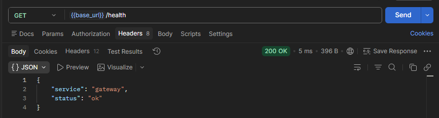

#### 02 — Auth Service Health
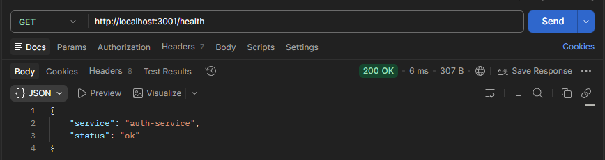

#### 03 — Ticket Service Health
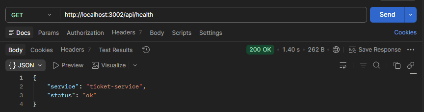

#### 04 — Payment Service Health
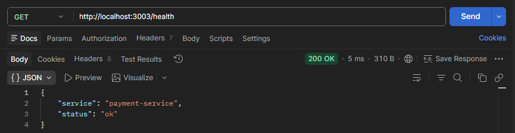

---

### Auth

#### 05 — Register as Organizer
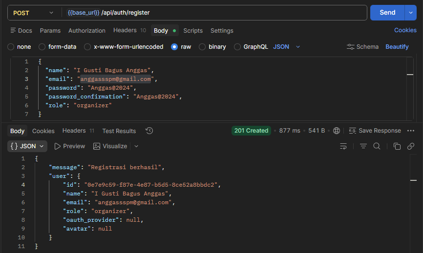

#### 06 — Register as User
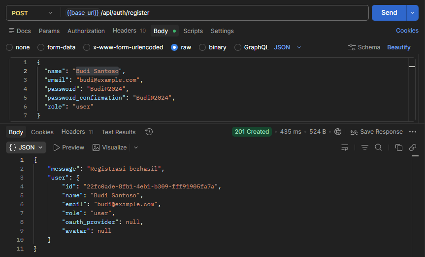

#### 07 — Login
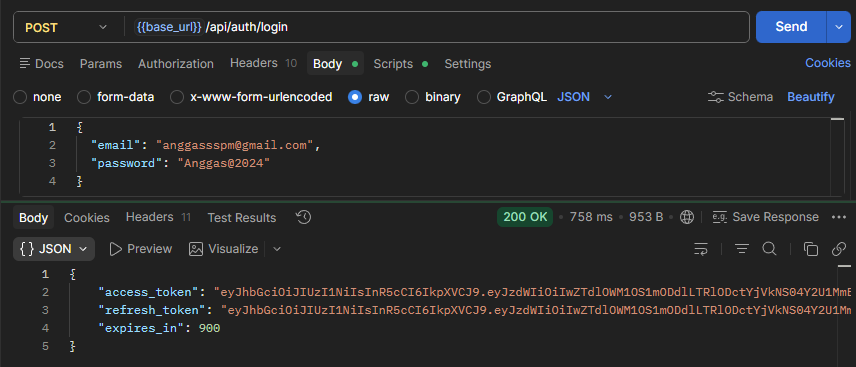

#### 08 — Me (Get Profile)
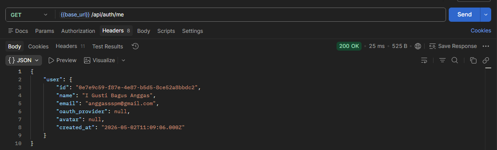

#### 09 — Refresh Token
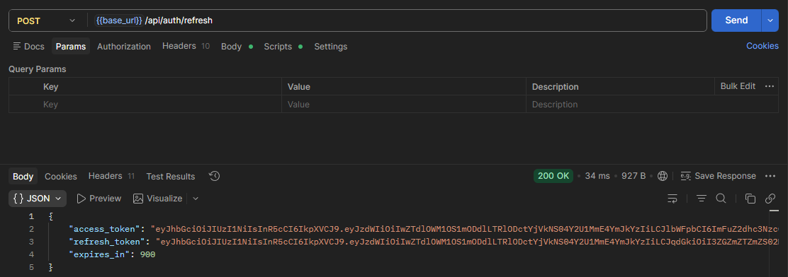

#### 10 — Logout
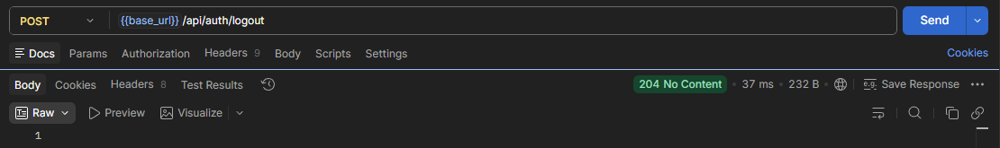

#### 11 — Google OAuth Redirect
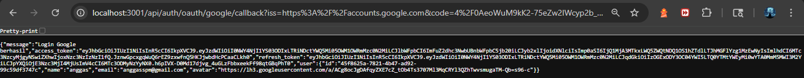

---

### Events

#### 12 — List Events
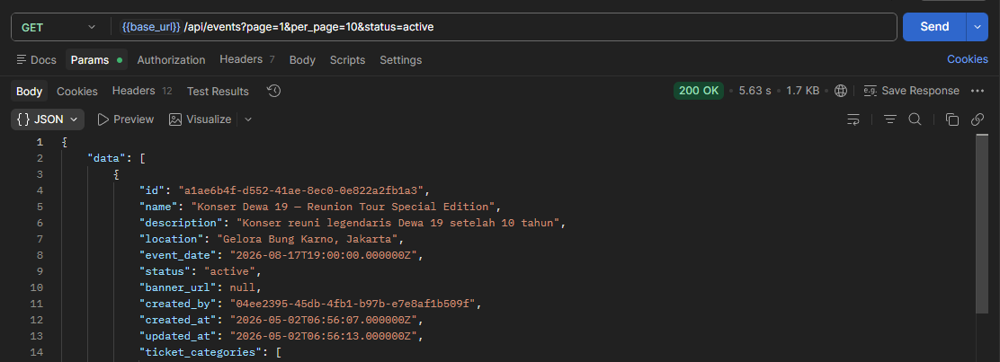

#### 13 — Get Event by ID
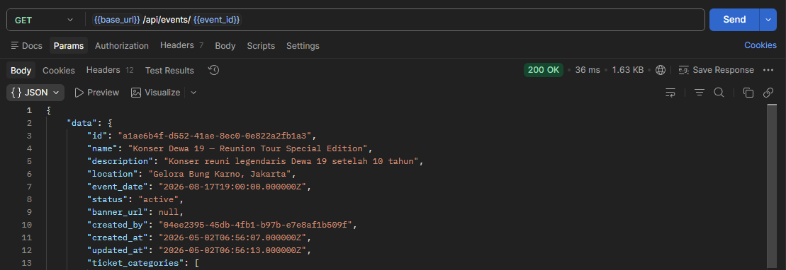

#### 14 — Create Event
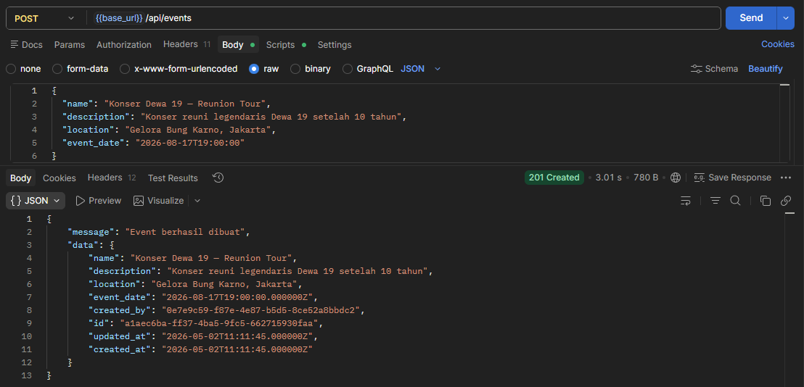

#### 15 — Update Event
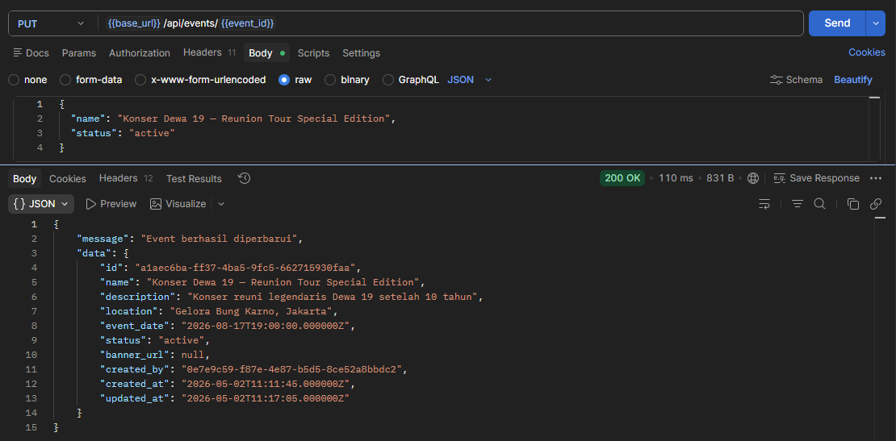

#### 16 — Delete Event
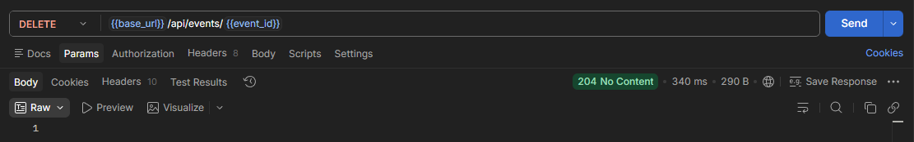

---

### Ticket Categories

#### 17 — List Categories by Event
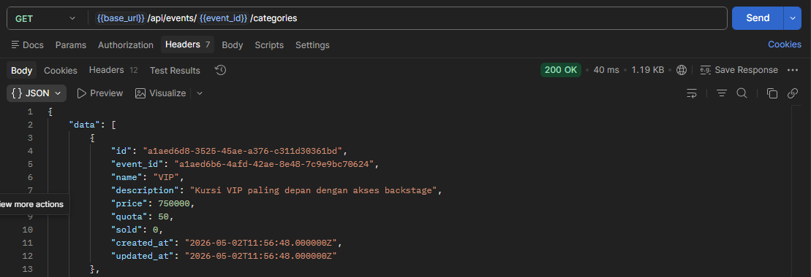

#### 18 — Get Category by ID
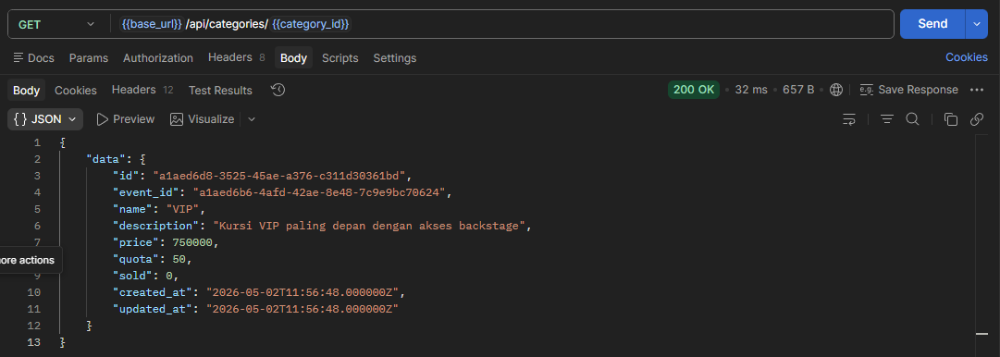

#### 19 — Create Category VIP
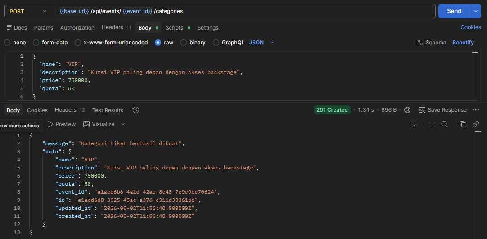

#### 20 — Create Category Regular
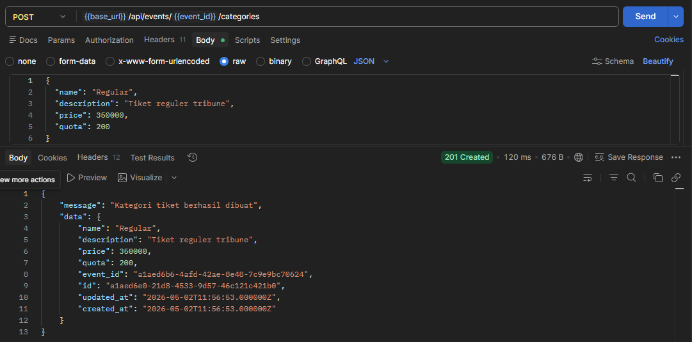

#### 21 — Create Category Student
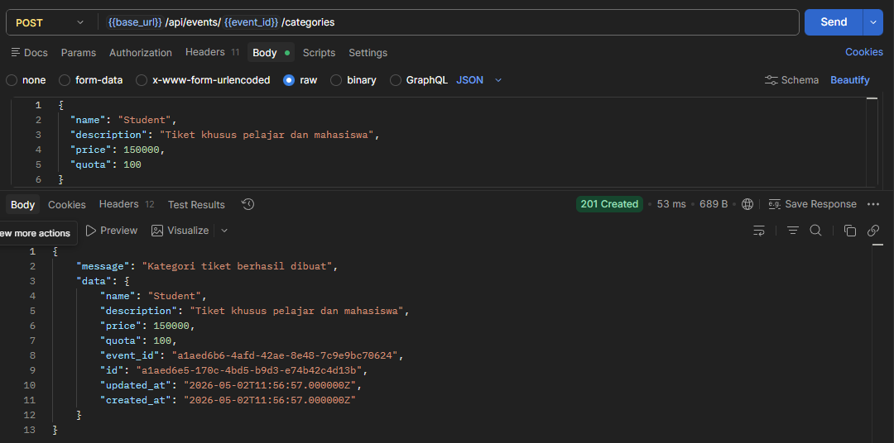

---

### Orders

#### 22 — List Orders
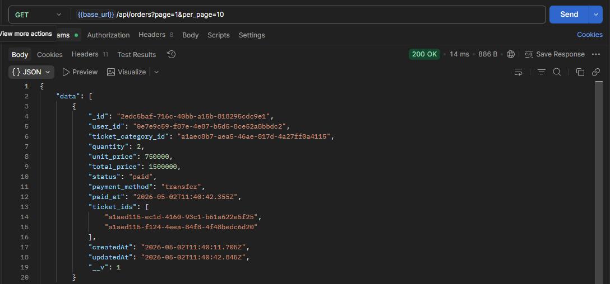

#### 23 — Create Order Checkout
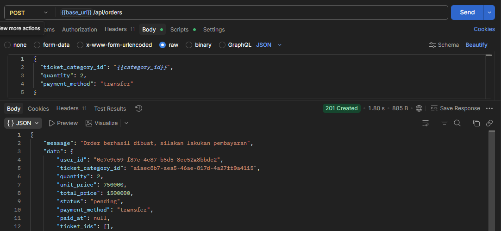

#### 24 — Get Order by ID
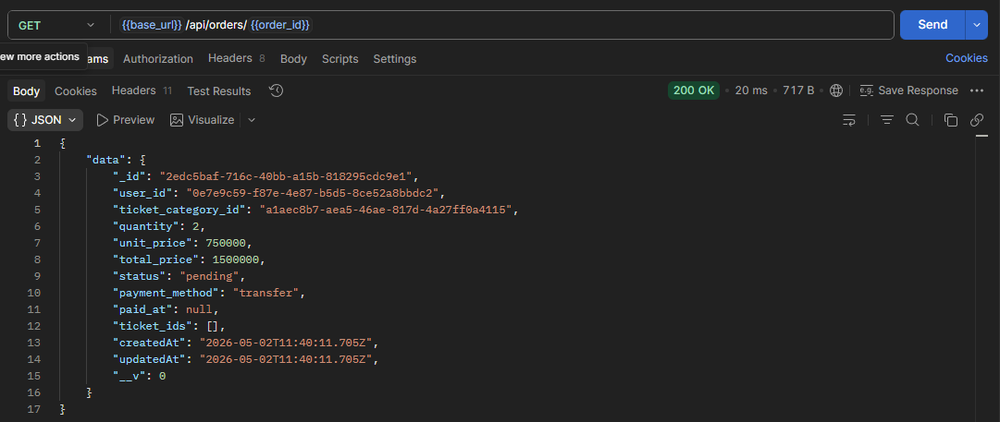

#### 25 — Confirm Payment
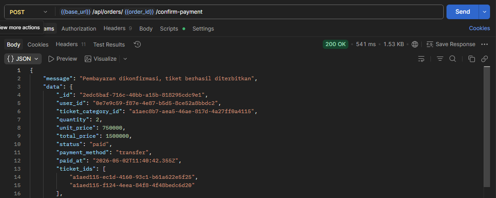

---

### Tickets

#### 26 — My Tickets
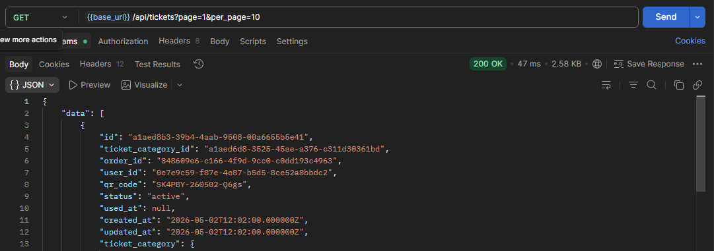

#### 27 — Validate QR
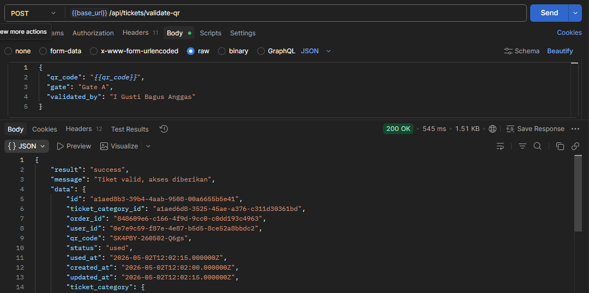

---

### Role Test

#### 28 — Create Event as User (403 Forbidden)
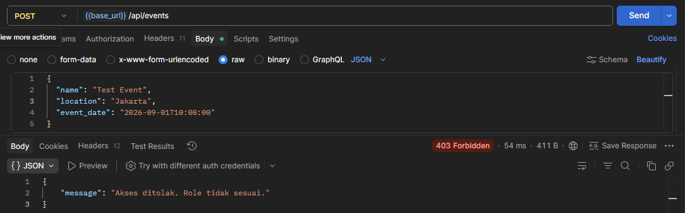

---

## Struktur Repository

```
uts-pplos-b-2410511080/
├── README.md
├── gateway/
│   ├── src/index.js
│   └── .env.example
├── services/
│   ├── auth-service/
│   │   ├── src/
│   │   │   ├── config/db.js
│   │   │   ├── controllers/AuthController.js
│   │   │   ├── controllers/OAuthController.js
│   │   │   ├── middlewares/jwtMiddleware.js
│   │   │   ├── models/AuthModel.js
│   │   │   ├── routes/auth.js
│   │   │   ├── utils/jwtHelper.js
│   │   │   └── index.js
│   │   └── .env.example
│   ├── ticket-service/
│   │   ├── app/Http/Controllers/
│   │   ├── app/Http/Middleware/
│   │   ├── app/Models/
│   │   ├── database/migrations/
│   │   └── routes/api.php
│   └── payment-service/
│       ├── src/
│       │   ├── controllers/OrderController.js
│       │   ├── models/Order.js
│       │   └── index.js
│       └── .env.example
├── docs/
│   ├── arsitektur.png
│   ├── laporan-uts.pdf
│   └── screenshots/
│       ├── 01-gateway-health.png
│       ├── 02-auth-health.png
│       ├── 03-ticket-health.png
│       ├── 04-payment-health.png
│       ├── 05-register-organizer.png
│       ├── 06-register-user.png
│       ├── 07-login.png
│       ├── 08-me.png
│       ├── 09-refresh-token.png
│       ├── 10-logout.png
│       ├── 11-oauth-google.png
│       ├── 12-list-events.png
│       ├── 13-get-event.png
│       ├── 14-create-event.png
│       ├── 15-update-event.png
│       ├── 16-delete-event.png
│       ├── 17-list-categories.png
│       ├── 18-get-category.png
│       ├── 19-create-category-vip.png
│       ├── 20-create-category-regular.png
│       ├── 21-create-category-student.png
│       ├── 22-list-orders.png
│       ├── 23-checkout.png
│       ├── 24-get-order.png
│       ├── 25-confirm-payment.png
│       ├── 26-my-tickets.png
│       ├── 27-validate-qr.png
│       └── 28-forbidden-403.png
├── postman/
│   └── collection.json
└── poster/
    ├── poster-uts.pdf
    └── poster-uts.png
```

---

## Konvensi Commit

Repository menggunakan format [Conventional Commits](https://www.conventionalcommits.org/):

- `feat:` — fitur baru
- `fix:` — perbaikan bug
- `docs:` — perubahan dokumentasi
- `refactor:` — refactoring kode
- `test:` — menambah/mengubah test
- `chore:` — perubahan konfigurasi/setup